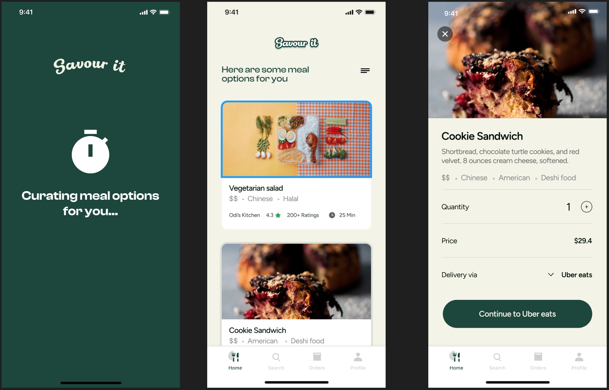

# SavourIt: Backend

> SavourIt helps users create a shortlist of meal options from nearby restaurants based on their mood and budget making the problem of “what to eat” less time-consuming and stressful



## API Repo

[SavourIt API](https://github.com/Co-Lab-You-Belong-in-Tech/savourit_api)

## Built With

- Major languages (Ruby)
- Framworks (Ruby on Rails)

## Live Demo

[SavourIt Backend](https://savourit.onrender.com/)

## Getting Started

To get a local copy up and running follow these simple example steps.

### Prerequisites

### Install

- Ruby
- Ruby on Rails
- PostgresSQL

### Using it Locally

- Clone the project

```
git clone https://github.com/Co-Lab-You-Belong-in-Tech/savourit_backend
cd savourit_backend
```

### Setup

Install gems with:

```
bundle install
```

Setup database with:

```
rails db:create
rails db:migrate
rails db:seed
```

### Usage

Start server with:

```
rails server -p 3001
```

Visit http://localhost:3001/ in your browser.

## Authors

👤 **J. AFLIH**

- [GitHub](https://github.com/jaflih)
- [LinkedIn](https://www.linkedin.com/in/jaflih/)

## 🤝 Contributing

Contributions, issues, and feature requests are welcome!

Feel free to check the [issues page](../../issues/).

## Show your support

Give a ⭐️ if you like this project!

## 📝 License

This project is [MIT](./MIT.md) licensed.
